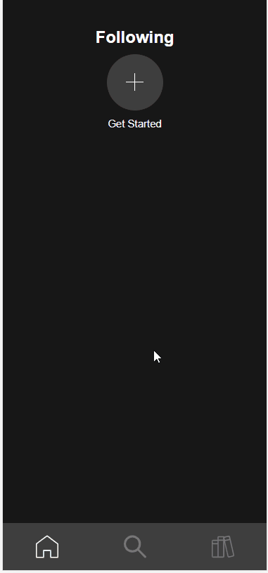
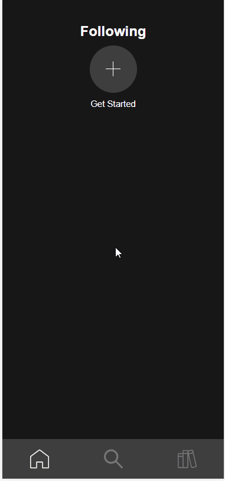
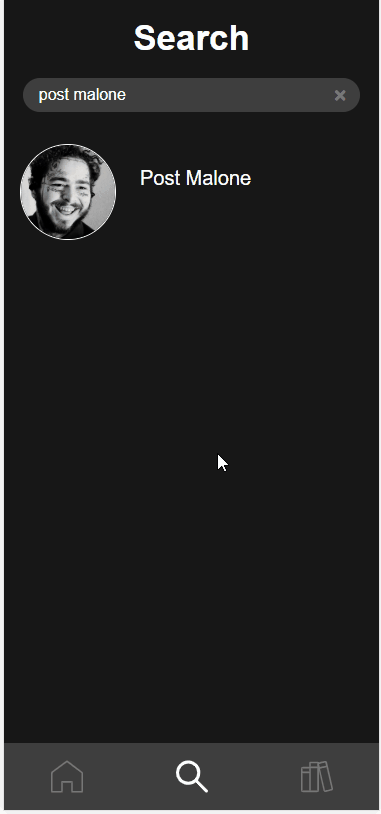
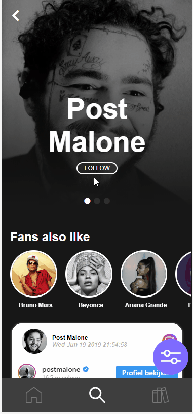

# Linernote Design rationale

## Inhoud
- [Debriefing](#Debriefing)
    - [Opdrachtgever](#Opdrachtgever)
    - [Wat is Linernote?](#Wat-is-Linernote?)
    - [Het probleem](#Het-probleem)
    - [Doelgroep](#Doelgroep)
- [Het Product](#Het-Product)
    - [Werking](#Werking)
    - [User Scenario](#User-Scenario)
- [Design keuzes](#Design-keuzes)
- [Code](#Code)
  - [Database](#Database)
- [Conclusie](#Conclusie)

## Debriefing
### Opdrachtgever
Onze opdrachtegever was Joost de Boo, Joost is een grafisch ontwerper en werkte bij een platenlabel toen het idee voor Linernote ontstond. Het concept "Linernote" is bedacht door [Joost de Boo](http://www.joostdeboo.nl/). 

### Wat is Linernote?
Linernote is een media platform met content van Instagram, Twitter, YouTube, Spotify en WikiPedia over verschillende artiesten. De data wordt opgehaald uit de API's en opgeslagen in een eigen database. Gebruikers loggen in door middel van Spotify.
Linernote is een app waarin alle muziek gerelateerde applicaties en social media samenkomen. Het idee is om de beste features en content van deze apps samen te brengen en het zo voor (online) muziek liefhebbers makkelijker te maken om alle online content van artiesten te bekijken.

`Content van artiesten` + `achtergrond informatie` + `evenementen`

> **liner note**   
> *noun*   
> " the text printed on a paper insert issued as part of the packaging of a CD or on the sleeve of a record. "

### Het probleem
> "Het is niet gemakkelijk om online muziekfan te zijn"

Het is begrijpelijk dat muziekliefhebbers soms niet weten waar ze het moeten zoeken. Op internet zijn talloze platformen te vinden die op een of andere manier met muziek te maken hebben. Een belangerijke bevinding is dat er 3 verschillende muziekliefhebbers zijn.

1. `context` -> Deze groep mensen in geinteresseert in het leven van de artiest en de context van de muziek. Platformen als [Genius](...) en magazines richten zich op deze doelgroep.

2. `product` -> Deze groep mensen is geinteresseert in de muziek zelf. Apps als [Spotify](...) en [SoundCloud](...), platformen waar de muziek centraal staat, richten zich op deze doelgroep.

3. `productie` -> Deze groep mensen is geinteresseert in de techniek en de making-offs van de producten.

### Doelgroep
De Linernote app is bedoeld voor iedereen die meer wilt weten over zijn/haar favoriete artiesten. Doelgroep moet wel bekend zijn met de volgende platforms om het uiterste uit de Linernote app te halen:
*   Spotify
*   Instagram
*   Twitter
*   Ticketmaster
*   Youtube
Dit komt, omdat de app voornamelijk bestaat uit embedded iframes van de hierbovenstaande platforms. De gebruiker kan dan ook interacteren met deze iframes, maar het vergt wel enige kennis over die platform.  

## Het Product
Het product wat wij hebben gemaakt is de Linernote app. De Linernote appt zorgt ervoor dat de gebruiker zijn/haar favoriete artiest kunnen volgen op populaire social media via één applicatie maar!
Gebruikers kunnen op de Linernote App
- [x] Artiesten volgen
- [x] Artiesten pagina's bezoeken
- [x] Recente updates/social-media posts van gevolgde artiesten in de een feed bekijken
- [x] Posts van de gevolgde artiesten sorteren en filteren
- [x] Via ticketmaster upcoming events van artiest vinden

Beschikbare Social Media Platforms in Linernote App:

### Werking
1.  Het eerst wat de gebruiker ziet is een inlog scherm. De gebruiker dient eerst in te loggin via zijn/haar spotify account. Hierdoor krijgt Linernote app toestemming om de data te gebruiken van de gebruiker om de beste Linernote ervaring aan te bieden.
<p align="center">

</p>
2.  In de Zero State krijgt de gebruiker geen posts te zien. De gebruiker moet eerst een artiest gaan volgen om posts te laten weergeven in de homescreen. Dit kan gedaan worden door of op het plusje te klikken en dan artiest naam invullen of via de navigatie onderin op het vergrootglas te klikken en dan artiest naam invullen.
*   Plusje
    <p align="center">
    
    </p>
*   Vergrootglas
    <p align="center">
    
    </p>
3.  Na het selecteren van een artiest, komt de gebruiker op de artiesten pagina terecht. Hier kan de gebruiker alle posts zien die de artiest heeft gepost op de tot nu beschikbare platforms van de Linernote app.
<p align="center">

</p>
4.  De gebruiker kan deze artiest volgen door simpelweg op de follow button te klikken. Deze button word paars om aan te geven dat de gebruiker deze artiest heeft gevolgd.
<p align="center">

</p>
5.  Als de gebruiker terug gaat naar de homepagina, kan de gebruiker ook zien dat de posts van de gevolgde artiest nu allemaal worden geladen in de homepagina.
<p align="center">

</p>
### User Scenario
De applicatie is voor alsnog alleen gericht op mobiele gebruikers. De context waarin deze mensen specifiek Linernote zullen gebruiken is hierdoor lastig te bepalen. Het kan onderweg zijn of tijdens het wachten. Het zou ook kunnen helpen met inspiratie opdoen. 


## Design keuzes
Er zijn tijdens dit process binnen het project enkele design keuzes gemaakt die in het eerdere design (nog) niet waren meegenomen.
- `Inloggen met Spotify` (Oauth) -> Er is gekozen om gebruikers van de Linernote applicatie in te laten loggen met Spotify

- `Het gebruik van embeds en iframes` -> Wegens problemen met missende API's en andere complicaties is er gekozen om te werken met embeds en mogelijke iframes. Dit komt mede door de regelementen van enkele bronnen.

Binnen ons project hebben we nog enkele andere design keuzes gemaakt

- `Database` -> Wij hebben ervoor gekozen om de data te 'scrapen' en/of op te halen uit de API's en deze vervolgens op te slaan in een database.

- `Single page application` & `PWA` -> Het eindproduct is een single page-, progressive web application.

## Database
### Waarom?
Omdat de applicatie multi user support vraagt, een follow functie nodig heeft en er data uit veel verschillende bronnen komt. Willen wij de data opslaan in een database. De applicatie heeft data nodig uit Youtube, Instagram, Twitter en Ticketmaster. En om de gebruiker telkens zoveel requests te laten doen, duurt het lang voordat de gebruiker iets te zien krijgt. Het idee is om de gebruiker zo min mogelijk requests te laten doen.

### MYSQL of NOSQL

In dit prototype maken we gebruik van MYSQL, omdat het makkelijk is om in MYSQL relaties te maken tussen gebruikers en artiesten. En tussen artiesten en hun social media posts.  

### API's

We hebben er voor gekozen om een SPA te maken, zodat de web applicatie een app gevoel krijgt omdat de gebruiker niet telkens de website hoeft te herladen. Maar omdat de server geen nieuwe pagina's rendert moet er nieuwe data worden opgevraagd door middel van een API. De API is vrij simpel met een paar endpoints.

Met deze endpoint word een lijst van vijftien artiesten opgevraagd.
```
/api/v1/artists

Type request: GET
```

Met deze endpoint kan de gebruiker een enkele artiests opvragen door middel van een id of een naam

```
/api/v1/artist

parameters:
name : Accepteert een string (bijvoorbeeld Kendrick Lamar, maar kan ook zoeken op een deel van een string zoals emi en zoekt dan een artiest met emi in de naam)
id : Accepteert een int

Type request: GET
```
Met deze endpoint kan er een gebruiker worden opgehaald

```
/api/v1/user

Parameter:
id: Accepteert een int

Type request: GET

```

Met deze endpoint kan de gebruiker een artiest volgen

```
/api/v1/user/follow

Parameters:
userId: Accepteert een int
artistId: Accepteert een int

Type request: POST

```
Met deze enpoint kan de gebruiker een artiest ontvolgen

```
/api/v1/user/follow

Parameters:
userId: Accepteert een int
artistId: Accepteert een int

Type request: DELETE

```

### Codebase

De codebase van de database kan [hier](https://github.com/Zekkieb/linernote-db) worden gevonden


## Conclusie
Linernote gebruikers kunnen een eigen muziek bubbel creëeren door favoriete artiesten te volgen en zo op de hoogte te blijven van het (online) leven van de artiesten. Linernote is een mobiele applicatie voor elke muziekliefhebber. Gebruikte data is afkomstig van andere populaire platformen. Ook het design is hierop gebaseerd (Spotify, Netflix, Instagram) en daarom voor velen bekend en toegankelijk.