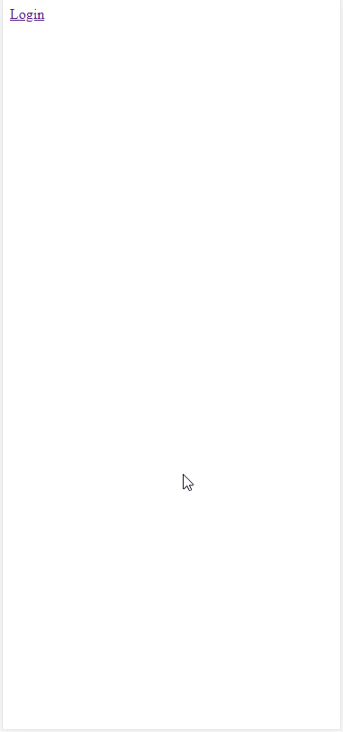
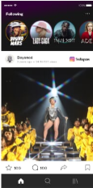
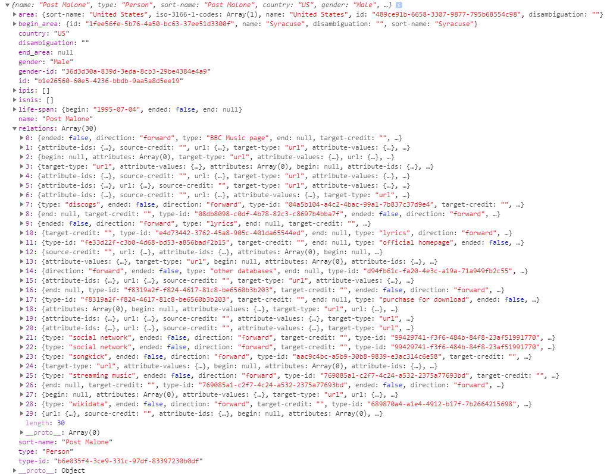

# Product Biografie
In de productbiografie kan je mijn proces vinden voor de meesterproef van de minor webdevelopment. Naast het proces kan je mijn persoonlijke leerdoelen hier vinden en de samenwerking met mijn team. 

## Inhoud
1.  [Inleiding](#inleiding)
2.  [Leerdoelen](#leerdoelen)
    *   [WAFS](#wafs)
    *   [RTW](#rtw)
3.  [Logboek](#logboek)
4.  [Zeflreflectie](#zelfreflectie)

## Inleiding
Voor de meesterproef heb ik mij ingeschreven bij Linernote. Dit project sprak mij aan, omdat het concept voornamlijk rondom het onderwerp muziek en artiesten draaide en zelf luister ik dagelijks muziek onderweg of tijdens het sporten. 

Tijdens deze meesterproef heb ik samengewerkt met May en Zekkie. En onze opdrachtgever was Joost van de Boo.

<!--  -->

### De opdracht
De bedoeling van  de opdracht is om een website te maken waar alle social media van je favoriete artiesten worden gebundeld en weergeven om 1 platform namelijk de Linernote website. Gebruikers kunnen artiesten volgen en van die artiesten worden dan de posts in de homepagina weergeven.  
Uiteindelijk wou Joost van de Linernote website ook een echte app van maken. 

**Opsomming**
*   Artiesten social media posts
*   Uiteindelijk een echte app
*   Artiesten volgen 

## Leerdoelen
Na de debrieving gehad te hebben van Joost van de Boo ben ik gaan wezen kijken welke leerdoelen het best bij de opdracht passen. De meeste leerdoelen heb ik uit het vak WAFS gehaald, omdat de opdracht zelf gebruik word gemaakt van API's en data manipulatie. Vandaar dat ik voornamelijk mijn leerdoelen uit WAFS heb gehaald.

### WAFS
Heel veel punten uit de rubric van WAFS waren van toepassing bij het project bij Linernote. Dit komt omdat voor Linernote het een vereiste is om veel API's te callen, om informatie te halen van artiesten. Wat onze opdrachtgever ook wou is dat het concept van Linernote uiteindelijk een app word. Mijn leerdoel is hierbij ook om de website een app-like gevoel te geven. Dit probeerde ik te bereiken door de website maar 1 keer te laden en dat de verschillende pagina's worden gerenderd door middel van fetches naar onze server.

#### Punten uit de rubric
*   `Je hebt, met behulp van een micro library, routes toegepast naar een overzichts- en een detailpagina.`
*   `De flow is dusdanig gevisualiseerd dat het helemaal helder is hoe de applicatie werkt`
*   `Je hebt andere slimme methodes gebruikt om JSON data te manipuleren`
*   `Je hebt je verdiept in de API en aan de hand van API docs de op te halen data zo efficient mogelijk opgevraagd`
*   `Ik heb geen enkele OCD source-formatting neiging als ik naar jouw code kijk. De structuur is volledig duidelijk en logisch opgezet`
*   `Het is gelukt om, met behulp van een micro library, JSON data te renderen naar HTML`

### RTW
Omdat ik de Linernote website een app-like gevoel wilt geven is het nodig om een open connectie te hebben met de server waardoor ik met gemak data kan opvragen vanuit de server. Ik heb daarom als leerdoelen het volgende uitgekozen uit het vak Real-Time Web.

#### Punten uit de rubric
*   `Je hebt methodes gecreëerd die clients in staat stelt middels jouw eigen API te communiceren met jouw server. Real time connectiviteit is op een slimme manier opgezet`

## Logboek
Hier kan je het logboek zien per week wat ik allemaal gedaan heb. Per week beschrijf ik hoe de week ging, Wat ik gedaan heb, mijn bevindingen en wat ik vond dat er beter kon in die week.

### Week 1
Onze debrief begon om half 10 in de Volkshotel. Tijdens de debrief werd kregen we te horen waarvoor de applicatie diende en welke api's de opdrachtgever voornamelijk in de applicatie wou zien. 
In de afbeelding hieronder kan je zien welke api's een must-have zijn en welke api's would-like.

In deze eerste week heb ik ook besloten om samen met Zekkie te werken aan de Linernote App. 
We hadden in deze week de afspraak gemaakt dat Zekkie de backend zou maken, zodat mensen kunnen inloggen/account aanmaken en dat gebruikers artiesten kunnen volgen. En ik zou de api's onderzoeken hoe we informatie eruit konden halen.

Na het onderzoeken van verschillende API's in de eerste week kwamen we er al snel achter dat de instagram api niet meer beschikbaar was voor openbaar gebruik en dat de meeste api's in onze must-have list een bepaalde authenticatie voor nodig was(ook wel OAUTH genoemd). Dit zorgt ervoor dat als de gebruiker op de Linernote app wilt komen eerst meerdere keren moet inloggen voordat hij/zij op de Linernote app zelf kwam.

#### Wat heb ik gedaan?
*   Team gemaakt(Zekkie + Loc)
*   Afspraken gemaakt wie doet wat
    *   Zekkie maakt de backend
    *   Ik onderzoek API's
*   Gezamelijk repo gemaakt
*   Api documentatie lezen(Spotify, Instagram, Ticketmaster, Youtube).
*   Ik ben begonnen met data ophalen van Spotify
*   Eerste interface versie gemaakt
    *   [Link Sourcecode](https://github.com/LaupWing/Linernote)
    *   
*   Eerste documentatie gemaakt 
    *   [Link Readme](https://github.com/LaupWing/Linernote)

#### Bevindingen
*   Data uit: Instagram, Spotify, Ticketmaster en Youtube is a must (Debrief)
*   Website word uiteindelijk een app (Debrief)
*   Instagram API niet beschikbaar (API onderzoek)
*   Spotify, Youtube is inloggen een vereiste (API onderzoek)
*   Meeste API's bieden een embed aan van een post, dit houd dat er een iframe word gemaakt van eenpost (API onderzoek)

#### Wat kon beter?
*   Afspraken noteren en heel duidelijk maken wie wat doet

### Week 2
In week 2 hadden we rond 10 uur afgesproken in het volkshotel voor feedback. Na het laten zien van onze prototypes kwam Joost op het idee om de posts te kunnen liken en commenten van de artiesten. Deze like en comment systeem werkt binnen de Linernote app. Dus de likes en comments worden niet naar de platform zelf gepost maar allemaal in de Linernote app zelf. Joost wou ook een wrapper rondom de embedded posts voor styling. In deze week besloot May ook om deel te nemen aan ons groepje.

#### Wat hebben ik gedaan?
*   Gekeken of er een wrapper rondom de embeds konden
*   Alternatieve mogelijkheden bekijken om data uit Instagram te halen
*   Opnieuwe server en frontendcode geschreven, zodat May samen met mij kon werken aan de prototype.   
*   Ticketmaster api toegepast

#### Bevindingen
*   Joost wou een wrapper rondom embedded posts voor styling
*   Joost wou dat de gebruiker onder elke post kon commenten en liken
    *   
*   May is bij ons in het groepje gekomen
*   Instagram is mogelijk door scrapen van de shortcodes met puppeteeer(node package)
*   Zekkie slaat alle data op in zijn eigen backend (Dat had ik niet verwacht)

#### Wat kon beter?
*   Afspraken noteren en heel duidelijk maken wie wat doet
*   Beter communiceren, ik vond het namelijk totaal onzin om alle data op te slaan in een database omdat ik het nut ervan niet in zag en totaal niet deel was van de opdracht zelf. Maar ik had niks daar niks over gezegd.

### Week 3
Deze week was er op een maandag een feestdag waardoor we geen feedback moment hadden met Joost. In deze week heb ik samen met May de applicatie interface gemaakt. Tijdens deze week waren en nogal onenigheden binnen ons groepje. Iedereen had een andere idee in zijn/haar gedachten voor dit product. En iedereen voerde maar zijn/haar eigen idee uit. Ik was van mening dat we gewoon de design en concept van onze opdrachtgever maar moeten aanhouden, maar May (met wie ik samen frontend taken had) had een andere mening hierover. Ik ben uiteindelijk maar meegegaan met haar mening en we werkten toen uit wat zij in haar gedachten had hoe dit product zou moeten uitzien. Verder was de database waar alle posts in worden opgeslagen bij lange na nog niet klaar, dus hadden we geen data om de homepagina te renderen. Ik besloot toen om zelf via de server api calls te maken om deze data toch te verkrijgen.

#### Wat heb ik gedaan?
*   Samen met May de artiesten pagina gemaakt
    *   Kleine effecten toegevoegd zoals uitzoom functie in de album carousel
    *   
*   Verder API's onderzoeken

#### Bevindingen
*   Samenwerken is moeilijker is dan ik gedacht had.
*   Iedereen had een andere opinie/idee over dit project

#### Wat kon beter?
*   Communicatie en bespreken over hoe en wat

### Week 4
Tijdens deze week waren ik en May niet aanwezig bij de feedback momentje met Joost. Zekkie was er wel van ons groepje. Na dit gesprek kwamen we erachter dat de design niet goedgekeurd werd door onze opdrachtgever. De opdrachtgever wou een exacte 1 op 1 kopie van zijn design. Dit zorgde dat het werk wat we de vorige week hadden gemaakt helemaal moesten schrappen. Ook hoorde Zekkie dat het liken en commenten niet meer nodig was en dat ook moest schrappen, en ook dit zorgde ervoor dat we een week aan werk of zelfs meer moesten weggooien. 

De design van Joost bestond voornamelijk uit de post embeds van de artiesten dus data hebben van elke artiest was van uiterste belang voor de frontend, maar helaas was Zekkie nog niet klaar met het opslaan van de data van verschillende artiesten. Hierdoor hadden ik en May niet veel te doen tijdens deze week. Ik had toen zelf maar weer geprobeerd om data uit de verschillende API's te halen, zodat wij verder konden gaan. Na een poosje onderzoeken stuitte ik op de MusicBrainz API. Dit was een hele fijne ontdekking, omdat we via de Musicbrainz API makkelijk naar de artiesten hun social media konden navigeren en daar data vandaan konden halen.

#### Wat heb ik gedaan?
*   API's data fetchen en implementeren in de frontend.
*   Frontend styling

#### Bevindingen
*   MusicBrainz API maakt het makkelijker om de social links te krijgen van Artiesten
    *   
        *   In elke relation heb je een URL waar we data van konden halen.
*   Design moest exact worden nagemaakt
*   Like systeem en commenten hoefde niet meer

#### Wat kon beter?
*   Wederom communcatie problemen